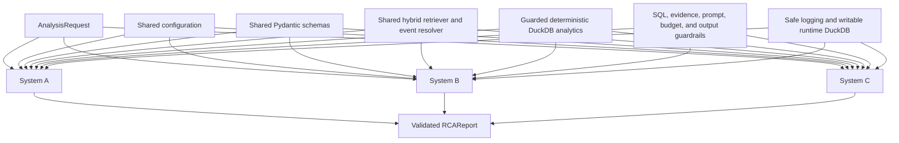
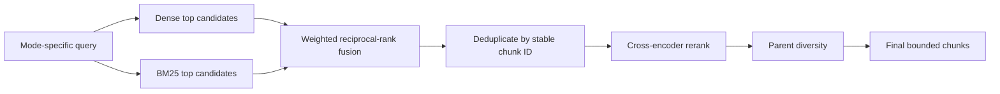
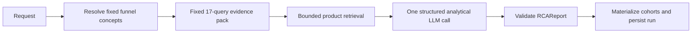
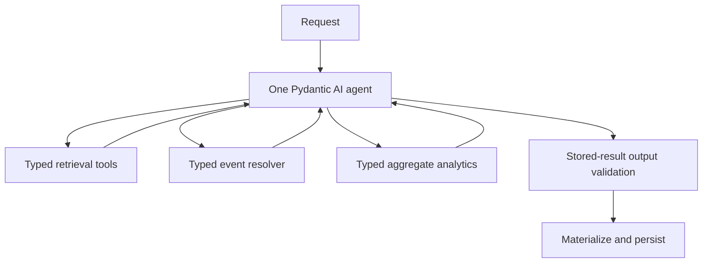
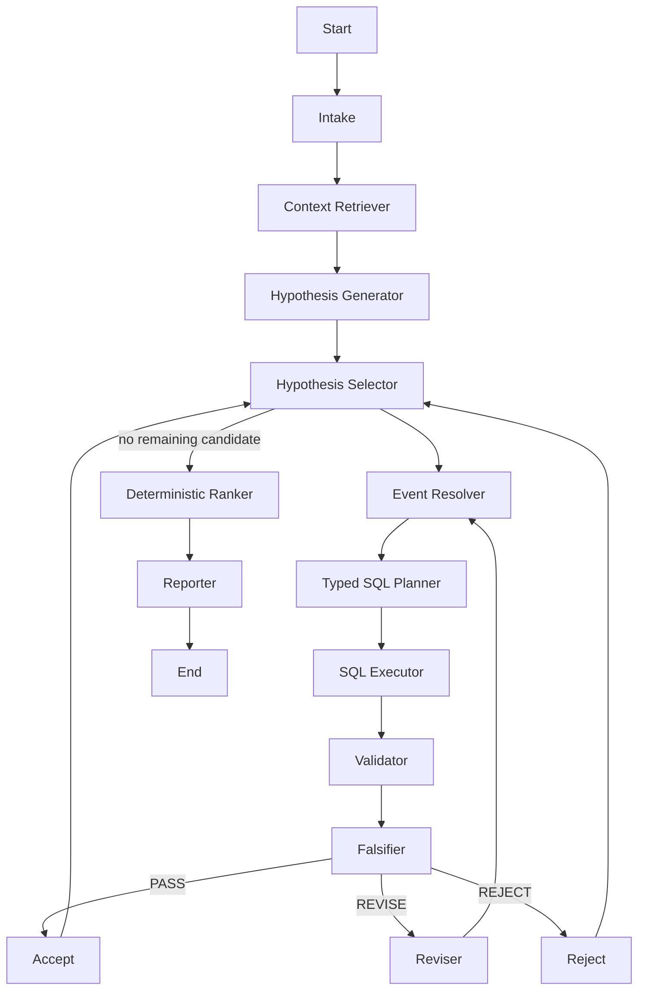

# Product RCA Agent — Implementation Guide

## 1. Problem and system objective

Product RCA Agent investigates regressions in a mobile-commerce funnel. Given an
agent-visible product specification, event taxonomy, support tickets, funnel and
metric definitions, plus a scoped DuckDB warehouse, it returns a ranked
`RCAReport` containing mechanisms, executable cohorts, query-backed evidence,
tested confounders, confidence, limitations, and unresolved questions.

Three systems share the same data and safety boundaries:

- System A: fixed Vanilla RAG analysis and one structured LLM call.
- System B: one Pydantic AI ReAct-style agent with typed tools.
- System C: a LangGraph workflow with explicit validation and falsification.

System code never reads scorer-only ground truth and this implementation does not
add evaluation, scoring, judge, comparison, dashboard, or UI infrastructure.

## 2. Architecture overview



All source telemetry stays in a read-only DuckDB. Runtime logs, aggregate cache
metadata, and predicted cohorts use a separate writable DuckDB.

## 3. Repository structure

```text
src/
  analytics/              deterministic aggregate analytics
  config/                 lazy environment configuration
  database/               source/runtime managers, views, query envelopes
  guardrails/             SQL, event, evidence, prompt, budget, logging guards
  observability/          application logging configuration
  retrieval/              corpus models, chunking, indexes, reranking, resolver
  schemas/                shared requests, hypotheses, reports, run metadata
  systems/
    bootstrap.py          shared agent-visible runtime construction
    cli.py                shared CLI request arguments
    system_a/             Vanilla RAG
    system_b/             Pydantic AI agent
    system_c/             LangGraph workflow
scripts/
  build-rag-index
  run-system-a
  run-system-b
  run-system-c
tests/
  test_config.py
  test_database_analytics.py
  test_guardrails.py
  test_retrieval.py
  test_schemas.py
  test_system_a.py
  test_system_b.py
  test_system_c.py
  test_system_integration.py
```

The existing `simulator/` and `eval/` directories are user-owned benchmark
components. Runtime systems do not import scorer code or ground-truth models.

## 4. Configuration

`src/config/settings.py` defines lazy `AppSettings`. Environment variables use
the `RCA_` prefix:

- `RCA_SOURCE_DUCKDB_PATH`, `RCA_RUNTIME_DUCKDB_PATH`
- `RCA_CHROMA_PERSIST_PATH`
- `RCA_EMBEDDING_MODEL`, `RCA_RERANKER_MODEL`, `RCA_LLM_MODEL`
- BM25, dense, rerank, final top-k, RRF, batch, and parent-diversity limits
- SQL row limit and minimum segment size
- System B tool/retrieval/analytical budgets
- System C revision and node-execution budgets
- query, tool, and node timeouts
- hypothesis, prompt-chunk, and chunk-character limits
- `RCA_LOG_LEVEL`

See `.env.example`. It contains no credentials. Client, model, Chroma, and
DuckDB initialization is lazy.

## 5. DuckDB schema

The source warehouse contains:

- `events(user_id, session_id, event_ts, event_name, screen, os, device_type,
  device_age_months, geo, channel, is_returning, latency_ms, is_crash,
  payment_method, instance_id)`
- `users(user_id, os, device_type, device_age_months, geo, channel,
  is_returning, acquired_ts, instance_id)`

User-level dimensions come from `users`; event-time behavior comes from
`events`. Joins use both `instance_id` and `user_id`.

## 6. Normalized views

`src/database/views.py` creates connection-local views:

- `v_events`: normalized dimensions and booleans, safe numeric/timestamp casts,
  normalized event name plus retained raw event name.
- `v_users`: normalized user dimensions and safe casts.
- `v_users_enriched`: adds device-age buckets: unknown, 0–11, 12–23, 24–35,
  36–47, and 48+ months.
- `v_events_resolved`: deterministic visible-taxonomy alias mapping with
  canonical event, resolution status, funnel step, drop-off flag, and version.

Only rows missing `instance_id` or `user_id` are removed.

## 7. Deterministic analytics

`src/analytics/service.py` provides:

- `get_instance_summary`
- `get_naive_funnel`
- `get_ordered_funnel`
- `compare_metric_by_dimension`
- `analyse_event_sequence`
- `compare_exposed_unexposed`
- `materialize_cohort`
- bounded `get_debug_sample`

Supported dimensions are OS, device type, device-age bucket, geography, channel,
returning status, payment method, and screen. Supported metrics are users, crash
rate, checkout crash rate, checkout completion rate, payment completion rate,
latency p50, and latency p95.

Crash rate uses distinct crashed users divided by distinct exposed users.
Checkout completion and crash metrics use ordered checkout windows. Ordered
funnels enforce temporal order and optionally same-session behavior.

## 8. RAG corpus

Only textual product knowledge is indexed:

- event taxonomy
- PRD/product specification
- synthetic support tickets
- funnel definitions
- metric definitions

Raw events, users, query results, materialized cohorts, manifests, scorer labels,
and answers are never embedded.

## 9. Chunking strategy

`src/retrieval/chunking.py` uses document-specific chunking:

- taxonomy: one canonical event; aliases and graph relationships stay together
- PRD: heading-aware parents and children with parent IDs and bounded overlap
- tickets: one short ticket or semantic sections for long tickets
- funnels: valid and alternate paths stay intact with optional-step semantics
- metrics: numerator, denominator, grain, events, minimum size, and limitations
  stay together

Whitespace is normalized while snake_case identifiers are preserved. Stable IDs,
content hashes, metadata, and exact duplicate removal make indexing reproducible.

## 10. Dense retrieval

`ChromaDenseIndex` stores the shared chunks in the configured persistent Chroma
directory. Embeddings load on first explicit index/query operation. Index updates
are batched and content-hash-aware.

## 11. BM25

`BM25Index` indexes the identical chunk set. Its tokenizer preserves underscores
and exact technical identifiers, making aliases, event names, and metric names
lexically searchable.

## 12. Reciprocal Rank Fusion



`reciprocal_rank_fusion` is deterministic and uses the configured RRF constant
and retrieval-mode weights.

## 13. Cross-encoder reranking

The configured CPU-safe cross-encoder reranks fused candidates. It loads lazily.
Tests inject lexical or fake rerankers, so credentials and model downloads are not
required.

## 14. Event resolution

`CanonicalEventResolver` performs exact alias lookup first, then taxonomy BM25,
dense retrieval, RRF, screen/activity boosts, reranking, and grouping by canonical
event. Confidence policy:

- at least 0.85: automatic
- 0.65–0.84: usable with warning
- below 0.65: unresolved

Low-confidence events are never silently queried. The shared runtime bootstrap
derives funnel aliases only from the agent-visible taxonomy descriptions.

## 15. Shared schemas

`src/schemas/models.py` defines `TimeWindow`, `AnalysisRequest`,
`CohortDefinition`, `Evidence`, `ConfounderTest`,
`RootCauseHypothesis`, `RCAReport`, and `RunMetadata`.

All systems return the same strict `RCAReport`. Extra fields are rejected,
confidence is bounded to 0–1, instance IDs must agree, and mutable collections use
factories.

## 16. Safe SQL execution

The primary path is typed deterministic analytics. The explicit fallback accepts
one `SELECT` or `WITH` statement over allowlisted views, requires a bounded
literal `LIMIT`, validates identifiers, binds values as parameters, enforces
instance scope and timeout, and blocks comments, multiple statements, mutations,
attachments, extensions, copies, and protected table patterns.

Model text never becomes a table, column, metric, or dimension identifier.

## 17. Cohort materialization

The shared cohort compiler converts supported `CohortDefinition` fields into
parameterized predicates scoped to the request instance. Validated predicted user
sets are materialized only in the runtime database. Full user lists are never
placed in prompts, graph state, logs, or final reports.

## 18. Guardrails

Shared boundaries cover:

- mandatory instance scope and instance-aware joins
- read-only source and separate writable runtime stores
- blocked manifest, ground-truth, scorer, label, and answer patterns
- typed/allowlisted SQL and cohorts
- canonical-event requirements
- aggregate prompt/result limits
- System B tool budgets and timeouts
- System C revision, node, timeout, and cycle limits
- query/chunk evidence traceability
- strict structured output validation
- safe redacted logging without secrets, raw cohorts, hidden data, or private
  chain-of-thought

Invalid reports are recorded as failed and never persisted as successful.

## 19. System A



`src/systems/system_a/` is non-agentic. It always runs the same evidence list,
exposes no tools, accepts no model-generated SQL, and has no analytical retry or
revision loop. One schema-repair call is allowed only when structured output is
invalid.

## 20. System B



`src/systems/system_b/` injects shared services and exposes nine narrow typed
tools. It allows at most 15 total, four retrieval, and ten analytical calls.
Duplicate typed calls return cached results. Event-dependent analytics require a
prior successful resolution.

## 21. System C



`src/systems/system_c/` uses explicit LangGraph state and nodes. Graph state
contains bounded text and aggregate query envelopes, never raw telemetry or full
cohorts.

## 22. Falsifier and revision loop

The Validator asks whether primary evidence is valid and supportive. The
Falsifier asks what evidence would make the mechanism wrong and executes a
relevant counter-test. Supported categories include temporal precedence,
screen/event reach, exposed/control comparisons, device-age/type, OS, crash,
payment, geography, channel, returning status, latency, expected drop-off,
optional/alternate paths, missing/deprecated aliases, session scope, and
naive/ordered funnels.

PASS accepts; REVISE narrows the mechanism/cohort and returns to event resolution;
REJECT keeps only an internal concise trace. Each hypothesis permits at most two
non-identical revisions. Ranking weights are 30% evidence strength, 20% effect
size, 15% cohort specificity, 15% temporal precedence, and 20% falsification
resistance.

## 23. Setup commands

```bash
python -m venv .venv
source .venv/bin/activate
python -m pip install -r requirements.txt
python -m pip install -r requirements-dev.txt
cp .env.example .env
```

Set the provider credential in the environment or local untracked `.env`.

Generate agent-visible local data if needed:

```bash
python -m simulator.generate --n 24 --users 8000 --seed 1000
```

## 24. Index-building command

```bash
./scripts/build-rag-index --instance-id inst_003
```

This explicitly builds or content-hash-updates the shared Chroma index. First use
may download the configured embedding and reranker models.

## 25. Commands to run A, B, and C

All three commands accept identical request options:

```bash
./scripts/run-system-a --instance-id inst_003 --symptom "checkout conversion declined"
./scripts/run-system-b --instance-id inst_003 --symptom "checkout conversion declined"
./scripts/run-system-c --instance-id inst_003 --symptom "checkout conversion declined"
```

Optional arguments:

```bash
--funnel-name shopfunnel
--suspected-screen checkout
--incident-window 2026-01-15T00:00:00+00:00 2026-01-29T00:00:00+00:00
--baseline-window 2026-01-01T00:00:00+00:00 2026-01-15T00:00:00+00:00
--data-root data
```

Use ISO-8601 timestamps. Window end must be later than start.

## 26. Testing

Credential-free unit and mocked integration tests:

```bash
.venv/bin/python -m pytest -q
```

Focused integration tests:

```bash
.venv/bin/python -m pytest -q tests/test_system_integration.py
```

The repository does not configure a separate formatter, linter, or static type
checker. Python bytecode compilation can be checked with:

```bash
.venv/bin/python -m compileall -q src
```

## 27. Troubleshooting

- Missing task/warehouse: generate data and verify `data/tasks/task_<id>.json`
  points to an existing warehouse.
- Missing provider key: export the credential required by `RCA_LLM_MODEL`.
- First retrieval is slow: run `./scripts/build-rag-index --instance-id inst_003`.
- Chroma telemetry warnings mentioning `capture()` indicate an incompatible
  PostHog version. Reinstall `requirements.txt`; the project disables Chroma
  telemetry and pins the compatible PostHog API range.
- Unresolved event: inspect agent-visible taxonomy aliases; never lower the
  confidence threshold to force a mapping.
- Empty segment result: lower neither safety nor isolation; verify the cohort and
  configured minimum segment size.
- Tool/node budget error: narrow the symptom or context. Do not disable budgets.
- Invalid evidence: numeric values must match the cited stored query result and
  product facts must use retrieved chunk IDs.

## 28. Known schema limitations

- Cohorts support equality/range filters but not arbitrary boolean expressions,
  negation, OR groups, or nested predicates.
- `RCAReport` has no dedicated materialized-cohort-reference field; System C
  records the runtime query reference in limitations and run storage.
- Time windows are accepted by all CLIs and shared schemas, but not every current
  deterministic metric applies baseline/incident comparison internally.
- Product-fact citations share `Evidence.source_chunk_ids`; there is no separate
  top-level product-fact collection in `RCAReport`.
- The visible benchmark taxonomy is alias-oriented. Shared bootstrap groups only
  the nine known funnel concepts by agent-visible descriptions and never uses the
  scorer-only canonical manifest.
- SQL planning is a typed operation plan, not a general SQL AST. Unsupported
  analytical questions must remain unresolved rather than falling back to model
  SQL.

## FastAPI Demo API

`src/api/app.py` provides a small synchronous FastAPI surface over the existing
System A, B, and C pipeline entry points. Synchronous execution is intentional:
the demo is called only a few times and does not need jobs, queues, polling,
Redis, Celery, persistent API-run storage, authentication, or rate limiting.

### Start the server

```bash
source .venv/bin/activate
uvicorn src.api.app:app --reload
```

Interactive documentation:

- Swagger UI: `http://127.0.0.1:8000/docs`
- ReDoc: `http://127.0.0.1:8000/redoc`
- OpenAPI JSON: `http://127.0.0.1:8000/openapi.json`

Local CORS origins come from `RCA_API_CORS_ORIGINS` and default to
`http://localhost:3000` and `http://localhost:5173`. Wildcard origins are
rejected while credentials are enabled.

### Endpoints

- `GET /api/v1/health`
- `POST /api/v1/analyse/system-a`
- `POST /api/v1/analyse/system-b`
- `POST /api/v1/analyse/system-c`
- `POST /api/v1/analyse/compare`

Analysis requests accept only `instance_id`, `symptom`, optional
`funnel_name`, optional `suspected_screen`, and optional incident/baseline
`TimeWindow` values. Extra fields—including SQL, paths, models, prompts,
manifests, system names, and budgets—produce a schema validation error.

```json
{
  "instance_id": "inst_003",
  "symptom": "Investigate the checkout funnel and identify the most likely root cause",
  "funnel_name": "purchase",
  "suspected_screen": "checkout"
}
```

An individual endpoint returns safe system metadata and the existing
`RCAReport`:

```json
{
  "system": "system_a",
  "instance_id": "inst_003",
  "status": "completed",
  "duration_ms": 1250,
  "result": {}
}
```

The comparison endpoint runs A, B, and C independently and sequentially using the
exact same `AnalysisRequest`. It does not score, judge, rank, or pass one
system's result into another. If one system fails, the other completed reports
remain in the HTTP 200 comparison response.

Errors contain a stable code and generic message. They never include exception
details, stack traces, prompts, credentials, database paths, raw telemetry, full
cohorts, hidden data, or chain-of-thought. Existing database, retrieval, event,
SQL, evidence, budget, and output guardrails remain active.

### Curl examples

Health:

```bash
curl http://127.0.0.1:8000/api/v1/health
```

System A:

```bash
curl -X POST http://127.0.0.1:8000/api/v1/analyse/system-a \
  -H 'Content-Type: application/json' \
  -d '{"instance_id":"inst_003","symptom":"Investigate checkout conversion"}'
```

System B:

```bash
curl -X POST http://127.0.0.1:8000/api/v1/analyse/system-b \
  -H 'Content-Type: application/json' \
  -d '{"instance_id":"inst_003","symptom":"Investigate checkout conversion"}'
```

System C:

```bash
curl -X POST http://127.0.0.1:8000/api/v1/analyse/system-c \
  -H 'Content-Type: application/json' \
  -d '{"instance_id":"inst_003","symptom":"Investigate checkout conversion"}'
```

All three:

```bash
curl -X POST http://127.0.0.1:8000/api/v1/analyse/compare \
  -H 'Content-Type: application/json' \
  -d '{"instance_id":"inst_003","symptom":"Investigate checkout conversion"}'
```

### Example frontend flow

1. The frontend sends `POST /api/v1/analyse/compare`.
2. The API runs A, B, and C.
3. The API returns all three reports, retaining safe failures independently.
4. The frontend displays three columns: System A, System B, and System C.
