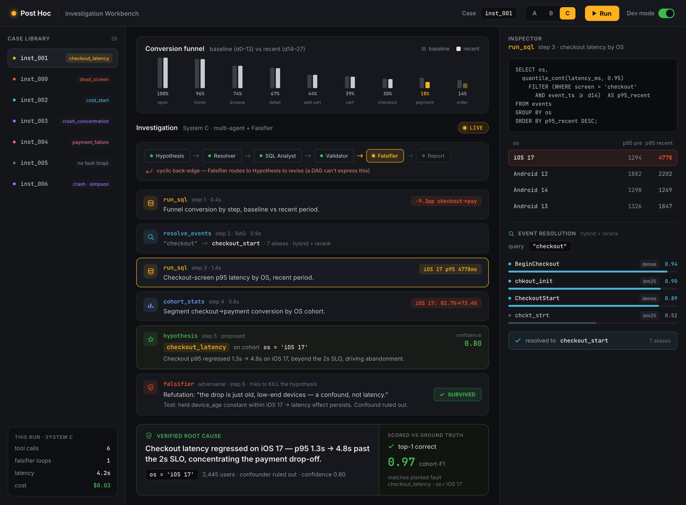
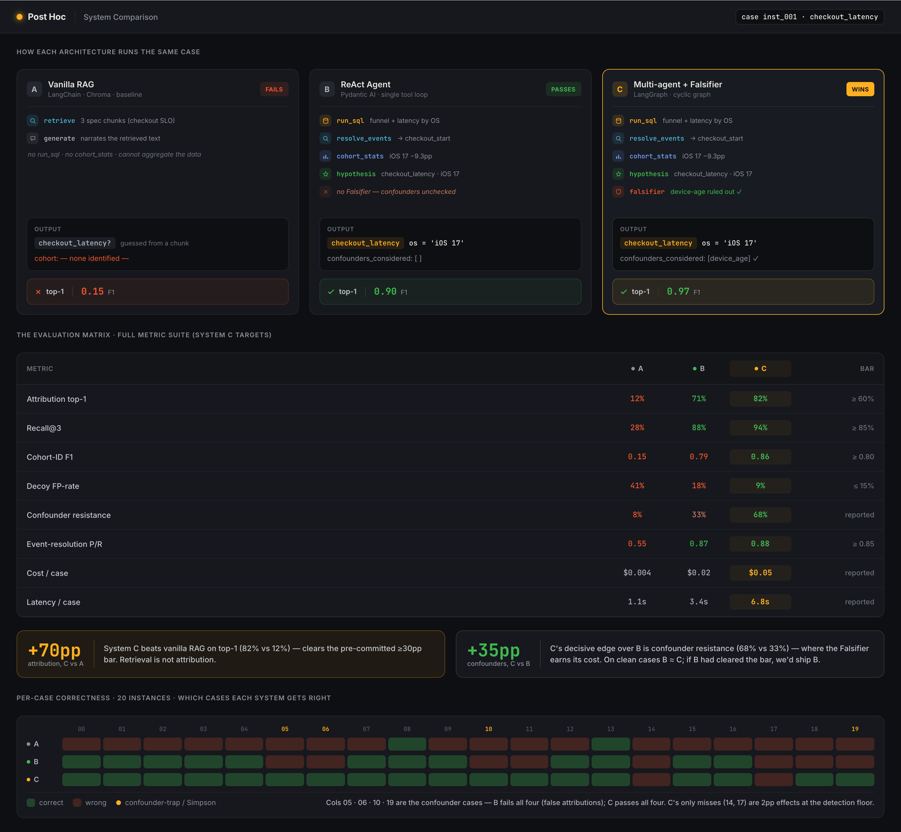

# UI Plan — the Investigation Workbench

**Owner:** Vinay · **Stack:** React/Next (designed in Paper) + FastAPI + SSE · **Gate:** 22 Jul 2026
**Related:** [data-and-ui-plan.md](data-and-ui-plan.md) · [generated-data-overview.md](generated-data-overview.md)

---

## 0. Mockups (designed in Paper)

Static high-fidelity mockups. These are visual references for the build, not code.

**The Investigation Workbench** — one System-C run on `inst_001`: the funnel symptom,
the live agent trace (tool calls streaming, the LangGraph node pipeline with the
Falsifier back-edge), the Inspector (SQL result + RAG event-resolution), and the
verified root-cause card scored against ground truth.



**System Comparison (A · B · C)** — how each architecture runs the same case, the
full metrics matrix, the headline gaps, and the per-case correctness grid (B fails
exactly the confounder/Simpson cases; C survives them).



> Metric values in the mockups are **illustrative** — they encode the expected
> story until the real A/B/C agents run through `eval/run_case`.

---

## 1. What this UI is (and what it is for)

Two audiences, one product:
- **Testbench** (us): run System A / B / C on a case, watch it work, compare outputs against ground truth.
- **Showcase** (mentors / demo video): a compelling, legible demonstration that the agent *reasons* — it runs real queries, resolves messy events, and actively tries to disprove itself — rather than narrating a guess.

**Design principle: the reasoning IS the product.** The project's thesis is accountability — turning *"users drop at checkout"* into a **verified** root cause. So the UI's centre of gravity is not the answer card; it is the **live trace of the agent's work**: the tool calls, the SQL it ran and the rows it got back, the event-name resolution, and the Falsifier killing weak hypotheses. If a reviewer can watch the evidence accumulate, the accountability claim is self-evident.

---

## 2. The concept: an "Investigation Workbench"

A single primary screen where you pick a case, hit Run, and watch an investigation unfold live — plus a secondary Comparison screen for the A/B/C scoreboard.

```
┌───────────────┬──────────────────────────────────────────┬────────────────────┐
│  CASE LIBRARY │  THE FUNNEL (the "symptom")               │  INSPECTOR         │
│               │  app_open ██████████ 100%                 │  (click any step   │
│  ○ inst_000   │  home     █████████░  96%                 │   in the trace to  │
│  ● inst_001 ◀ │  browse   ███████░░░  74%                 │   expand it here)  │
│  ○ inst_002   │  …                                        │                    │
│  ○ …          │  checkout ████░░░░░░ ▼ drop (recent)      │  ▸ SQL + result    │
│               ├──────────────────────────────────────────┤    table           │
│ System: [C ▾] │  THE INVESTIGATION  (live stream)         │  ▸ retrieval       │
│ [ ▶ Run ]     │                                           │    candidates      │
│               │  🔧 run_sql   funnel conversion by step   │  ▸ evidence/query  │
│ dev-mode:     │  🔍 resolve_events  "checkout" → …        │                    │
│ [reveal GT]   │  🧮 cohort_stats  by os …                 │                    │
│               │  💡 hypothesis  checkout_latency / iOS 17 │                    │
│               │  ⚔️ falsifier  "just old devices?" → KILLED│                   │
│               │  💡 hypothesis (revised) …                 │                    │
│               │  📄 report                                │                    │
│               ├──────────────────────────────────────────┤                    │
│               │  RESULT  ▸ ranked root-cause cards + score chip vs ground truth │
└───────────────┴──────────────────────────────────────────┴────────────────────┘
```

---

## 3. The panels

### 3.1 Case Library (left rail)
- List of instances from `warehouses/index.json`. Each row: id + a small fault badge only in **dev-mode** (`ground_truth/index.json`), hidden otherwise so the demo can be "blind".
- System selector: **A · B · C** (or "run all three").
- **Run** button. A **dev-mode toggle** reveals the planted fault + cohort for teaching/debugging (never sent to the agent).

### 3.2 The Funnel — the symptom (top centre)
- Horizontal funnel with per-step conversion, baseline vs recent overlaid, the regression step highlighted. Segmentable by attribute (os, device_type, …).
- This is 100% ours — it needs only the warehouse (the `inspect_instance` query already computes it). It sets up "here's WHERE; now watch the agent find WHY."

### 3.3 The Investigation — the agent's live work (centre; the centrepiece)
A streaming vertical timeline of **step cards**, appended as SSE events arrive. Card types:

| Card | Shows |
| :-- | :-- |
| 🔧 `run_sql` | the SQL (syntax-highlighted) + a collapsible result table |
| 🔍 `resolve_events` | the query term → ranked candidate event names → the resolved canonical (the RAG panel, §4) |
| 📄 `retrieve_spec` | the query → top PRD chunks, the decisive one highlighted (e.g. the SLO line) |
| 🧮 `cohort_stats` | the cohort predicate + the pre/post numbers |
| 💡 `hypothesis` | proposed mechanism + cohort + confidence (updates in place when revised) |
| ⚔️ `falsifier` | the refutation attempt, the confounder checked, and **SURVIVED / KILLED** |

Clicking any card expands its full payload in the **Inspector** (right rail). For **System C (LangGraph)** there is also a small **node-graph** header that lights up as control flows `HypothesisGen → EventResolver → SQLAnalyst → Validator → Falsifier`, with the **Falsifier's back-edge to revise animating** — the cyclic structure is the visual signature that a DAG can't produce.

### 3.4 Result + Score (bottom centre)
- Ranked **root-cause cards**: mechanism (stated as a claim), affected cohort (+ resolved user count), the evidence queries, confidence, and confounders ruled out.
- A **score chip** (dev-mode): top-1 ✓/✗, cohort-F1, false-positive flag — straight from `eval/scorer.py`.
- A **roadmap-brief** tab: the downstream demo artefact (unscored).

### 3.5 Comparison / Scoreboard (second screen)
- Run A/B/C on a case (or the whole set) → side-by-side: each system's top hypothesis, cohort-F1, cost, latency, and correctness vs gold.
- The headline the project is built to show: **C vs A attribution gap** and **B vs C**. This is "test the different solutions" made literal.

---

## 4. The RAG visualisations (called out because they're easy to under-build)

The retrieval story needs its own legible UI or it stays invisible.

**Event resolution** (the cursed-taxonomy payoff): for a `resolve_events` call, show the pipeline as columns —
```
query: "checkout"   →   BM25 candidates      →   + dense candidates     →   cross-encoder rerank   →   RESOLVED
                        chkout_init  (kw)         BeginCheckout (sem)        1. checkout_start ✓        checkout_start
                        chckt_strt   (kw)         CheckoutStart (sem)        2. begin_checkout          (7 aliases map here)
```
This directly renders "hybrid + rerank beats dense-only" — the exact claim in the design doc. Add a P/R chip vs the hidden canonical map (dev-mode).

**Spec retrieval**: query → top-k PRD chunks with scores, the decisive chunk highlighted (e.g. "checkout p95 < 2000 ms" or "the upsell is optional"). Shows *why* the agent knew a number was a defect, or a drop was innocent.

---

## 5. How it runs — the streaming architecture

The agent emits a **stream of typed trace events**; the UI renders them as they arrive. This event protocol is the **contract between the agent and the UI** (agree it with Shubham; a thin FastAPI adapter can wrap his agent if it doesn't emit these natively).

**Transport:** Server-Sent Events (SSE) over `POST /analyze`.

**Event types (the protocol):**
```jsonc
{ "type": "run_started",  "case_id": "inst_001", "system": "C" }
{ "type": "node_entered", "node": "SQLAnalyst" }            // System C only
{ "type": "tool_call",    "tool": "run_sql", "args": {"query": "SELECT …"} }
{ "type": "tool_result",  "tool": "run_sql", "summary": "…", "rows": [[…]], "columns": […] }
{ "type": "tool_call",    "tool": "resolve_events", "args": {"query": "checkout"} }
{ "type": "tool_result",  "tool": "resolve_events", "candidates": [{"name":"…","score":…,"source":"bm25|dense|rerank"}], "resolved": "checkout_start" }
{ "type": "hypothesis",   "id": "h1", "mechanism_type": "checkout_latency", "affected_cohort": "os = 'iOS 17'", "confidence": 0.8, "evidence": [...] }
{ "type": "falsifier",    "target": "h1", "attempt": "device-age confound?", "verdict": "survived", "detail": "…" }
{ "type": "edge",         "from": "Falsifier", "to": "HypothesisGen" }   // the back-loop, for the graph
{ "type": "final",        "hypotheses": [ …Hypothesis… ] }
{ "type": "run_complete" }
```

**API surface (FastAPI):**
- `GET /cases` → instance list (+ dev-mode ground truth).
- `GET /cases/{id}/funnel?segment_by=os` → funnel data for the symptom panel (warehouse only).
- `POST /analyze {case_id, system}` → **SSE** stream of the events above.
- `GET /score/{run_id}` → scorer output vs gold (dev-mode).
- **The manifest/gold is never sent through the agent path** — only `/funnel`, `/analyze` are agent-facing; scoring is a separate server-side call.

---

## 6. Tech stack

- **Frontend:** Next.js (App Router) + React, Tailwind for styling, a syntax highlighter for SQL, a light table component for results. Optional: React Flow for the System-C node graph.
- **Backend:** FastAPI, `sse-starlette` for streaming, DuckDB (read-only) for the funnel queries, our `eval/scorer.py` for scoring. The agent is imported as a callable (`run(warehouse, task) -> stream/list`).
- **Design:** the screens are laid out in Paper first, exported to React via the design-to-code skill.

---

## 7. Build sequence (don't block on the agent)

Only the Investigation panel needs the real agent; everything else runs on data we already own.

1. **Backend skeleton + mock agent** — `/cases`, `/funnel` (real, from the warehouse), and a **mock `/analyze`** that replays a canned event stream (we can generate one from `eval/run_case` output). The whole UI can be built and demoed against this.
2. **Frontend shell** — Case Library + Funnel + Result + Score, all real (data + `eval/scorer.py`).
3. **The Investigation stream** — render the trace event protocol against the mock stream.
4. **RAG panels** — event-resolution + spec-retrieval views (mock candidates first).
5. **Swap in Shubham's real agent** — via the §5 protocol; if his agent doesn't stream, the FastAPI adapter converts its steps into trace events.
6. **Comparison screen** — once ≥2 systems run.

---

## 8. Scope tiers (for the hard gate)

- **Must (gradeable + demoable):** Case Library, Funnel symptom, live Investigation trace (tool calls + results), ranked Result cards, score chip. Runs on ≥1 system.
- **Should:** event-resolution RAG panel, A/B/C Comparison scoreboard, roadmap-brief tab.
- **Could (polish / stretch):** the System-C animated node-graph with the Falsifier back-edge, spec-retrieval highlighting, cost/latency charts, replay/scrubbing of a past run.

Protect the **live trace** above all — it is both the testbench's core and the demo's wow.

---

## 9. The 3-minute demo narrative (what the UI must support)

1. Open a **blind** broken case; show the funnel — "users drop at checkout in the recent period. Why?"
2. Hit **Run (System C)**. Watch it stream: it runs SQL, **resolves the cursed `chkout_init`/`BeginCheckout` names**, segments by cohort, proposes *checkout latency on iOS 17*.
3. The **Falsifier** fires: "is this just old devices?" → runs a query → **rules it out** → hypothesis survives. (On a confounder-trap case, show it **killing** a wrong hypothesis and returning "no fault".)
4. Reveal the **root-cause card** with evidence, then flip **dev-mode**: it **matches the planted ground truth** (cohort-F1 0.97).
5. Cut to the **Comparison** screen: System A (vanilla RAG) got it wrong, C got it right — the ≥30pp gap, on screen.

That arc — symptom → live reasoning → self-falsification → verified-against-truth → A-vs-C — is the entire project told in one screen.
